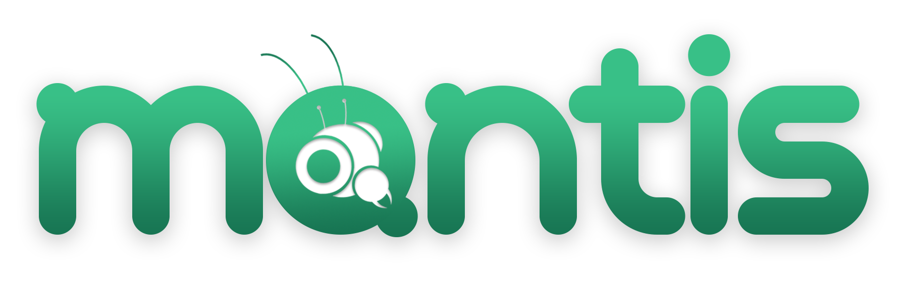

   

# Mantis

Mantis a COTS Software built for a curricular unit called Laboratory of Software Engineering, inserted on the plan of studies of the MSc Degree of Computer Engineer at the University of Minho. Besides being a project for a Curricular Unit, the Software is meant to be used on real context at the Technology Department at the same University.
As such, the present platform allows speeding up the equivalence attribution to students coming from outside of the Computer Engineer degree, or even outside University of Minho.
This system is built on two micro-services, using NodeJS at its core, both Backend and Frontendwise with a Client framework called VueJS with Vuetify. All data is stored on a NoSQL database system, MongoDB.

The detailed System Architecture and API endpoints can be found on the very own [Wiki](https://github.com/miguelsolans/equivalencias/wiki) of this repository, though in Portuguese, but will be translated to English very soon.

## Development Team

* [Diogo Araújo](https://github.com/dichico)
* [Diogo S. Nogueira](https://github.com/diogoesnog)
* [Miguel R. Solans](https://github.com/miguelsolans)
